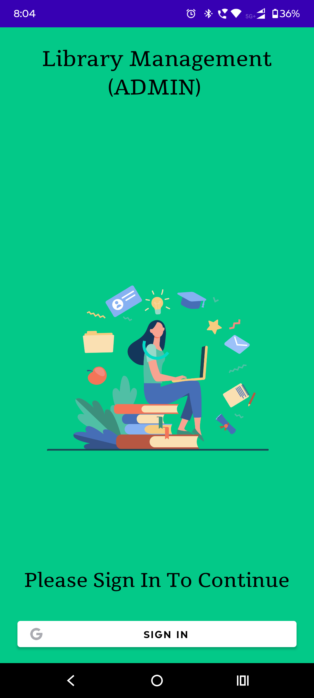
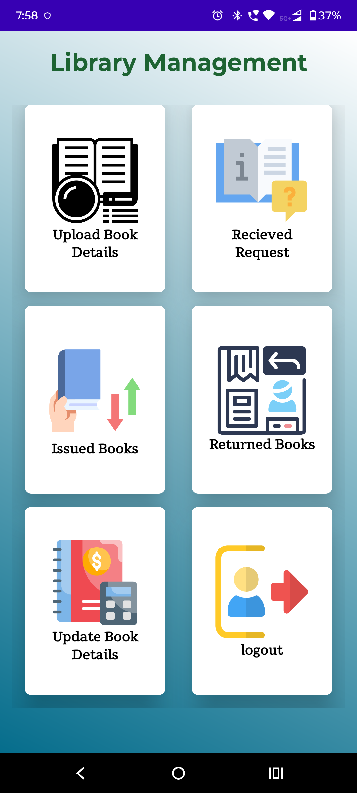
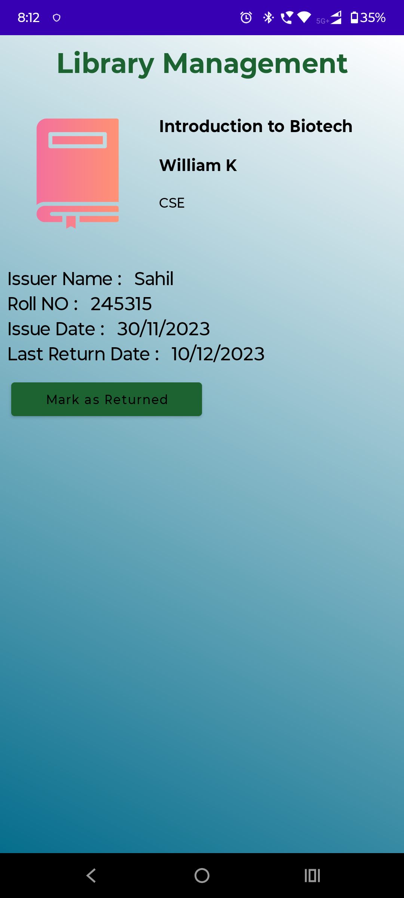
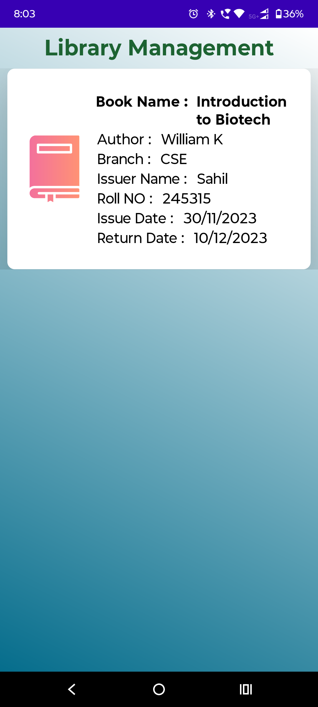
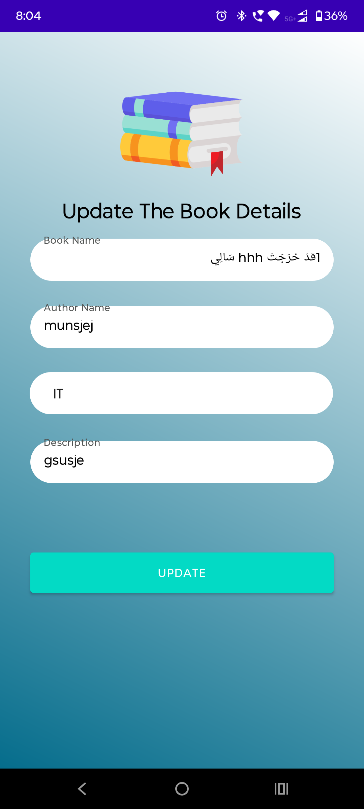
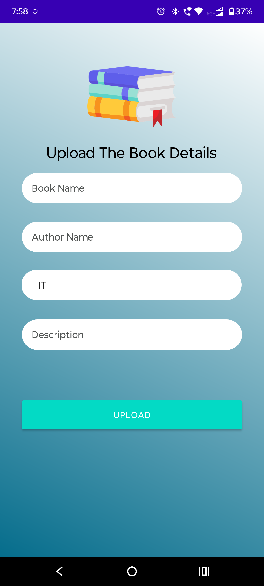

# Library Management System - Admin App 📚

## Overview
The **Library Management System - Admin App** is a comprehensive tool for librarians to manage library operations efficiently. It leverages **Firebase Authentication** for secure login and **Firebase Realtime Database** for real-time data management. The app allows librarians to oversee borrowed books, update book details, manage requests, and track returned books seamlessly.

---

## Features
- **Google Authentication:** Secure login using Firebase Authentication.
- **Manage Borrowed Books:** View and update the list of books borrowed by users.
- **Update Book Details:** Modify book information, including availability status.
- **Request Management:** Track and manage user requests for borrowing books.
- **Returned Books:** Maintain and update a list of books returned by users.
- **Real-Time Synchronization:** Ensure data consistency with Firebase Realtime Database.

---

## Technologies Used
- **Kotlin**: Primary programming language for app development.
- **Firebase Realtime Database**: Real-time backend for data storage and updates.
- **Firebase Authentication**: Secure and seamless Google login functionality.
- **XML**: For designing the app's user interface.

---

## Screenshots
### Login Page

### Admin Dashboard

### Borrowing Details

### Borrowed Books

### Book Details Update

### New Book Creation

---

## Installation

### Step 1: Clone this repository
    git clone https://github.com/your-username/library-management-admin-app.git

### Step 2: Open the project in Android Studio

### Step 3: Set up Firebase for the project
##### - Go to the Firebase Console (https://console.firebase.google.com/) and create a new project.
##### - Enable Realtime Database and Google Authentication under the Authentication section.
##### - Add your app's SHA-1 and SHA-256 keys from your local development environment:
#####   - In Android Studio, navigate to Gradle > Tasks > android > signingReport to find your SHA keys.
#####   - Copy the keys and add them to your Firebase project under Project Settings > Add Fingerprint.

### Step 4: Download the google-services.json file from Firebase
##### - Replace the existing google-services.json file in the app/ directory of the project with the one you just downloaded.

### Step 5: Build and run the project
##### - Sync the project with Gradle files in Android Studio.
##### - Connect your Android device or emulator and run the app.

This README includes all necessary details for setting up and understanding the **Admin App**, with instructions tailored to Firebase and real-time data synchronization. Let me know if you'd like further refinements! 😊
